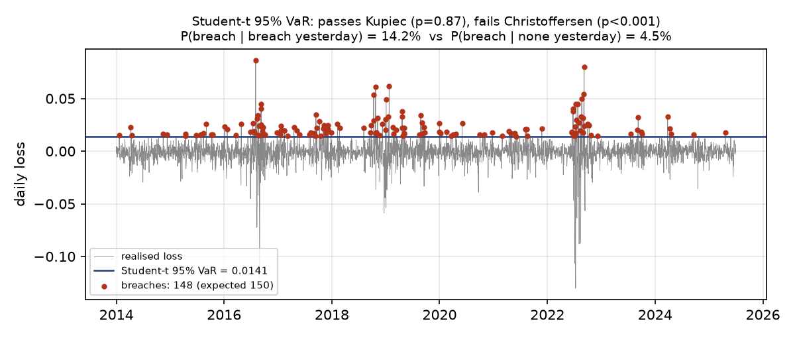

# tail-risk-mc

Monte Carlo simulation for **tail risk**, with a hands-on study of the gap
between **calibration** (fitting a model to data you've seen) and **reality**
(the losses the world actually delivers).

The project generates a known fat-tailed, volatility-clustering returns series,
calibrates three risk models to it, estimates Value-at-Risk (VaR) and Expected
Shortfall (ES) by Monte Carlo, and then *backtests* each calibration against the
realised data. The full write-up compiles to a PDF in [`notes/`](notes/).

## Layout

```
tail-risk-mc/
├── README.md
├── requirements.txt
├── src/
│   ├── config.py         # paths, RNG seed, risk levels, the "true" process
│   ├── generate_data.py  # GARCH(1,1)-t data generator  -> data/returns.csv
│   ├── calibrate.py      # MLE fits: Normal, Student-t, EVT/GPD -> results.json
│   ├── conditional.py    # GARCH(1,1) QMLE + EVT on residuals -> daily VaR
│   ├── simulate.py       # Monte Carlo VaR & ES (+ bootstrap std error)
│   ├── backtest.py       # Kupiec (count) + Christoffersen (independence) tests
│   └── plots.py          # regenerates every figure used in the notes
├── data/                 # generated dataset + results.json (calibration output)
├── figures/              # PDF figures for the LaTeX + fig_clustering.png for this README
└── notes/
    └── tail_risk_notes.tex  # the notes  ->  tail_risk_notes.pdf
```

## Run the pipeline

```bash
pip install -r requirements.txt
cd src
python3 generate_data.py   # the "reality"
python3 calibrate.py       # fit the three unconditional models
python3 conditional.py     # fit GARCH-filtered EVT (daily VaR)
python3 simulate.py        # Monte Carlo VaR / ES
python3 backtest.py        # calibration vs reality (Kupiec + Christoffersen)
python3 plots.py           # figures
```

Everything is seeded in `src/config.py`, so results reproduce exactly.

## Build the notes (PDF)

Requires a TeX distribution (MacTeX). With the **LaTeX Workshop** VS Code
extension, just open `notes/tail_risk_notes.tex` and save (build on save), or:

```bash
cd notes
latexmk -pdf tail_risk_notes.tex
```

## The one-line takeaway

Calibration always *succeeds* — it returns the best parameters **within the
family you assumed**. Whether that family can describe reality's tails is a
separate question, answered only by backtesting. Here the Normal model fits the
body of the data yet is statistically **rejected** in the tail, while the
Student-t and EVT models pass. The map is not the territory.

## Result: backtesting calibration against reality

3,000 realised days, each model's VaR checked against the same series. Two
questions, two tests (reject at p < 0.05):

- **Kupiec:** is the *number* of breaches consistent with the promised level?
- **Christoffersen:** are the breaches *independent*, or does a breach today
  make one tomorrow more likely? "P(b | b)" below is the breach rate on the day
  after a breach. Under independence it should equal the unconditional rate.

| Level | Model | VaR | Breaches (exp.) | Kupiec p | P(b \| b) vs P(b \| no b) | Christoffersen p |
|---|---|---:|---:|---:|---:|---:|
| 95% | Normal    | 1.71% | 100 (150) | **<0.001** | 11.0% vs 3.1% | **<0.001** |
| 95% | Student-t | 1.41% | 148 (150) | 0.867 | 14.2% vs 4.5% | **<0.001** |
| 95% | EVT / GPD | 1.39% | 150 (150) | 1.000 | 14.0% vs 4.5% | **<0.001** |
| 95% | GARCH-EVT | 1.39%* | 151 (150) | 0.933 | 6.0% vs 5.0% | 0.603 |
| 99% | Normal    | 2.45% | 42 (30)   | **0.038** | 7.1% vs 1.3% | **0.022** |
| 99% | Student-t | 3.23% | 23 (30)   | 0.180 | 0.0% vs 0.8% | 0.551 |
| 99% | EVT / GPD | 2.83% | 29 (30)   | 0.854 | 3.4% vs 0.9% | 0.286 |
| 99% | GARCH-EVT | 2.47%* | 28 (30)   | 0.711 | 0.0% vs 0.9% | 0.468 |

\* Average of a VaR that changes daily (0.69%–7.9% at 95%, 1.2%–13.9% at 99%).

**What Kupiec says.** The Normal model fails in both directions. Matching the
variance of fat-tailed data forces it to overstate the moderate tail (too few
breaches at 95%) and understate the extreme one (too many at 99%). It gets the
*shape* wrong, not just the scale. Student-t and EVT pass.

**What Christoffersen adds.** At 95%, *every* model fails, including the two
that pass Kupiec. On the day after a breach, the chance of another is about
three times the base rate. The reality is a GARCH process, where volatility
clusters, and a static VaR is breached in bursts during high-volatility spells.
Getting the tail *shape* right (t, EVT) fixes the count, but not the timing. Only a
conditional model, with VaR that moves with current volatility (for example
GARCH-filtered EVT), can fix that.



*The right count arriving at the wrong times: 148 breaches against 150 expected,
bunched into three volatility spells with long quiet stretches between them.*

**The fix: GARCH-filtered EVT** ([McNeil & Frey, 2000](https://doi.org/10.1016/S0927-5398(00)00012-8)).
Split the problem in two. GARCH(1,1) forecasts *how volatile* tomorrow will be,
using only information up to today. EVT models the *shape* of the tail of the
standardised shocks (returns divided by that forecast), which are close to
i.i.d. once the clustering is divided out. Daily VaR is the volatility forecast
times a fixed tail quantile. It is the only model that passes both tests at both
levels. At 95%, the chance of a breach on the day after a breach drops from 14% to
6%, against a 5% base rate. It also holds *less* capital on average at 99%
(2.47% vs Student-t's 3.23%) and still gets the count right: less in calm periods,
more in storms.

Checks that the pieces behave:
- GARCH QMLE recovers the true process: α = 0.097, β = 0.888, against a true 0.08
  and 0.90. When the model family is right, calibration finds the truth.
  Compare the unconditional Student-t's ν = 2.2 against a true 4.
- Dividing out volatility removes most of the kurtosis: excess kurtosis goes from
  23.7 on raw returns to 4.5 on the residuals.
- The residual tail index is ξ = 0.12, where a t(4) tail should give 0.25. This is
  the known bias of fitting a GPD at a moderate threshold, not a bug. The same fit
  on 2 million clean t(4) draws gives ξ ≈ 0.17 at the 90th-percentile threshold
  and climbs toward 0.25 only far out (0.20, 0.24, 0.24 at the 95th, 99th and
  99.9th; `python3 check_xi_bias.py`). With 300
  exceedances, 0.12 is within about one standard error of that.

**Caveats.**
- **The backtest is in-sample.** Every model is scored on the 3,000 days it was
  fitted to, which flatters them. For GARCH-EVT, each day's volatility forecast
  uses only past returns, but the parameters were fitted on the full sample. The GPD's 150/150 at 95% is close to automatic,
  because its threshold sits at this sample's 90th percentile.
- **The 99% passes are weak evidence.** With 23 to 29 breaches, only 0 to 1 of them
  fall on back-to-back days, so the independence test has little power, and the
  chi-squared approximation is rough at counts that small. A pass there means
  "not enough evidence of clustering," not "independent."

Reproduce with `python3 backtest.py`. Full numbers, including the joint
conditional-coverage statistic, are in `data/results.json`.

## Experiment

Edit the "reality" in `src/config.py` (`TRUE_NU`, `TRUE_BETA`, the confidence
levels) and re-run the pipeline to see how calibration tracks — or fails to
track — a different world.
